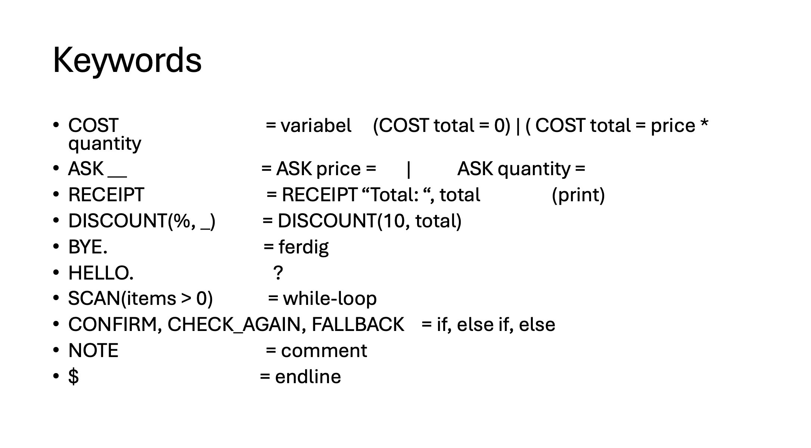

# CA$H

- [x] Lexer
- [x] Parser
- [x] Semantic analysis
- [ ] Interpreter
- [ ] Compiler



### Lexer: How to check Tokens?

1. Set path and aliases
   ```
   export CLASSPATH=".:/usr/local/bin/antlr-4.13.2-complete.jar:$CLASSPATH"
   alias antlr='java -jar /usr/local/bin/antlr-4.13.2-complete.jar'
   alias antdbg='java org.antlr.v4.gui.TestRig'
   ```
2. Generate lexer and parser
   ```
   antlr CASHTokens.g4
   ```
3. Compile lexer and scanner
   ```
   javac *.java
   ```
4. Debug language

   ```
   antdbg <LanugageFile> tokens -tokens <testFile>
   ```

   - Example:
     ```
     antdbg CASHTokens tokens -tokens Example\ code/helloWorld.csh
     ```

### Interpreter: Generate visitor

```
antlr4 -Dlanguage=Python3 CASH.g4 -o cash -visitor
```
