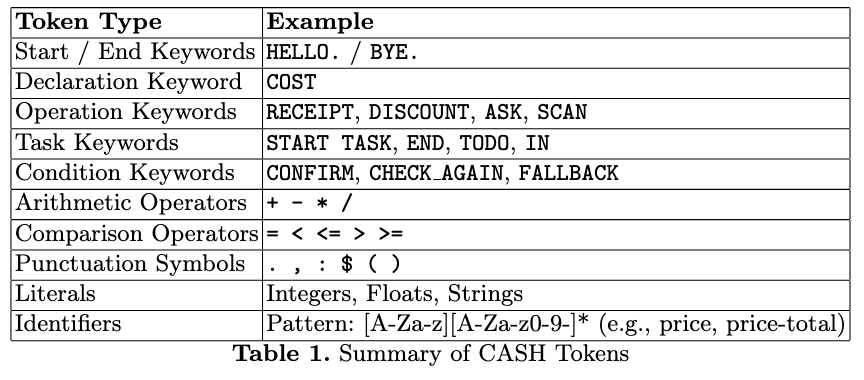

# CA$H



### Lexer: How to check Tokens?

1. Set path and aliases
   ```
   export CLASSPATH=".:/usr/local/bin/antlr-4.13.2-complete.jar:$CLASSPATH"
   alias antlr='java -jar /usr/local/bin/antlr-4.13.2-complete.jar'
   alias antdbg='java org.antlr.v4.gui.TestRig'
   ```
2. Generate lexer and parser
   ```
   antlr CASHTokens.g4 -o gen
   ```
3. Compile lexer and scanner
   ```
   javac gen/*.java
   ```
4. Debug language

   ```
   antdbg <LanugageFile> tokens -tokens <testFile>
   ```

   - Example:
     ```
     (cd gen && antdbg CASHTokens tokens -tokens ../example_code/helloWorld.cash)
     ```

### Interpreter: Generate visitor

```
antlr -Dlanguage=Python3 CASH.g4 -o interpreter/cash -visitor
```

Run interpreter
```
python interpreter/interpreter.py /path/to/file
```
With `helloWorld.cash` example:

```
python interpreter/interpreter.py example_code/helloWorld.cash
```

### Compiler: Compile a file

Install llvmlite

```
pip install llvmlite==0.44.0
```

#### Compile a file

Example for `helloWorld.cash`

```
antlr -Dlanguage=Python3 CASH.g4 -o compiler/cash -visitor
python compiler/compiler.py example_code/helloWorld.cash
```

#### Syntax highlighting (optional)
VSCode exclusive syntax highlighting extension
```
code -- install - extension syntax - highlighting / cash -0.0.1. vsix
```
